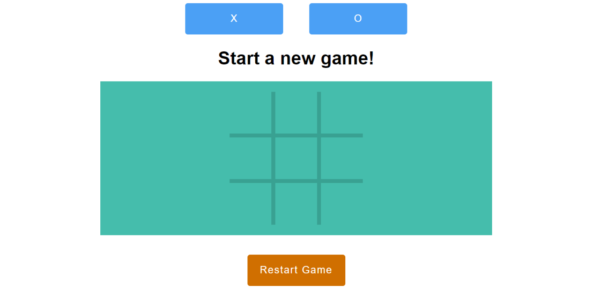

## Tic-Tac-Toe/React

### Screenshot:
  
  
#### [Link to Repo](https://github.com/Arathurs/Tic-Tac-Toe-V2.git/)  

### About the Project

Simple tic-tac-toe web application game, created with React.

### Rules of the Game

##### ***X*** always goes first. A user may choose to be either ***X*** or ***O*** but whichever player is ***X*** will always go first.
##### Users may choose either ***X*** or ***O*** by clicking either of the buttons on top displaying the appropriate symbol, which also results in starting the game.
##### Clicking on an empty block automaticatically starts the game and sets the player as ***X***, because again, ***X*** is always first.
##### The game will always display whose turn is next once the game starts.
##### A winner is once a player fills a block which results in at least one vertical, horizontal, or diagonal row containing only their symbol.
##### If there is no winner after a player fills the last block, the game results in a draw.
##### Clicking on the ***Restart Game*** button below will reset the game and erase the playing board. To start another game, pick a symbol up top or fill a block on the board to immediately become ***X***.

### Fixes v4

- Improved the visual design of the app using CSS5.
- Refactored code to enhance performance, efficiency and readability.
- Refactored code to follow best practices in clearly separating containter elements from presentational elements.
- Fixed tiny design and performance bug fixes in previous verson.

### To Do

- Make computer player smarter
- Instead of making random moves have the computer survey the current tic-tac-toe board to decide an optimal move.
- Implement a function that gives the computer player the cabapility to detect and act on instant wins. For example, Computer player is 'O' and it's the Computer's turn. If there are any rows with at least two 'O's, the computer will find it and place an 'O' there to automatically win.
- Implement a function that allows the computer to plan multiple optimal moves ahead, depending on the current board, at least 2-3 actions ahead.
- Implement a feature that would allow the player to choose the difficulty of the game. Difficulty can be controlled by simulating human error by using Math.random() to give the computer specific odds of picking the optimal move. The harder the difficulty chosen, the more likely the computer is to not make "mistakes".
- Refactor isThereAWinner(), which check if the most recent move resulted in a win. Currently it is highly inefficient, utilizing a brute force method which checks all 8 rows for a possible win. It only needs to check the ***affected*** rows of a recent move, which at most can be four.